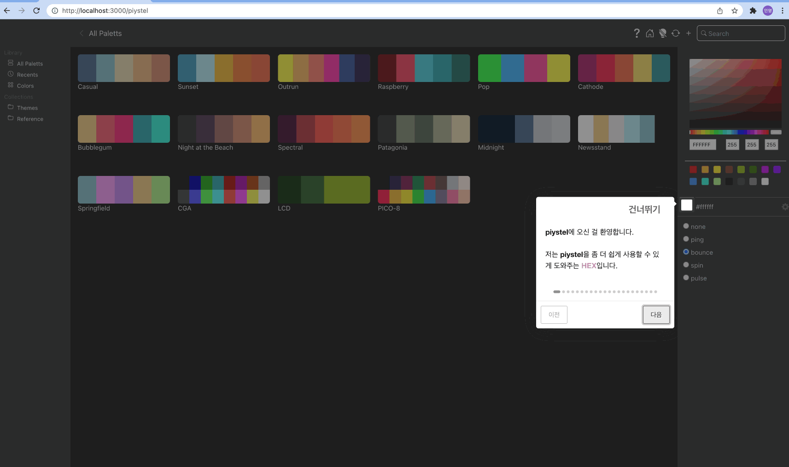

# PIYoung (<https://github.com/PIYoung>)

## Description

- 모노레포로 작성 중인 개인 포트폴리오입니다.

## Portfolio Desktop(ReactJS)

- Homepage: <https://piyoung.github.io/portfolio-public/>
- Project: piystel
- Author: PIYoung
- Period: 2022. 02. 26 ~ 2022. 02. 28.
- Node: v16.13.1
- ReactJS: v17.0.2
- DevTool: VSCode
- Reference: <https://www.highcaffeinecontent.com/blog/20200610-Pastel>

```bash
  # Run React App
  yarn
  yarn desktop start

  # OR

  cd apps/desktop
  yarn
  yarn start
```


